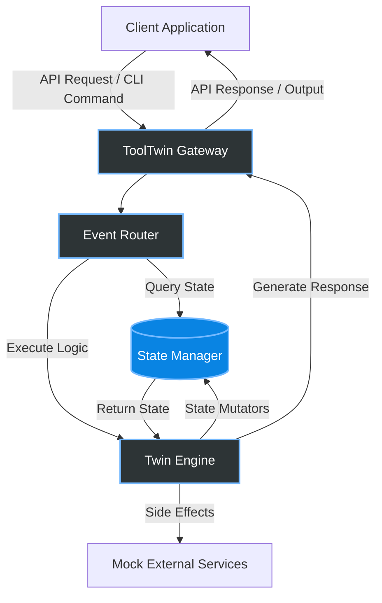

<div align="center">
  <h1>👯 ToolTwin</h1>
  <p><strong>The Ultimate Digital Twin Framework for Developer Tools and APIs</strong></p>

  <p>
    <a href="https://github.com/tooltwin/tooltwin/actions"></a>
    <a href="https://www.npmjs.com/package/tooltwin"></a>
    <a href="https://hub.docker.com/r/tooltwin/core"></a>
    <a href="https://github.com/tooltwin/tooltwin/blob/main/LICENSE"></a>
  </p>
</div>

ToolTwin is a powerful, lightweight framework for creating **high-fidelity digital twins** of your APIs, CLI tools, and microservices. 

Stop wrestling with fragile mocks and brittle test environments. ToolTwin gives you production-grade simulation capabilities—allowing you to mock complex stateful systems for testing or inject edge-case faults without ever touching production.

## ✨ Why ToolTwin?

- **Stateful by Default:** Simulate real database and memory states effortlessly. No more stateless, dumb mocks.
- **Protocol Agnostic:** Seamlessly supports REST, GraphQL, gRPC, and standard streams (stdin/stdout).
- **Time-Travel Debugging:** Rewind, inspect, and replay tool interactions with surgical precision.
- **Zero-Config Developer Experience:** Get started instantly with intelligent defaults. Just define your initial state and go.

---

## 🚀 Quick Start

Get your first digital twin running in under 60 seconds.

### 1. Install

Pick your preferred package manager or container runtime:

```bash
# npm (Node.js)
npm install -g tooltwin

# Homebrew (macOS/Linux)
brew install tooltwin/tap/tooltwin

# Docker
docker pull tooltwin/core:latest
docker run -p 8080:8080 tooltwin/core
```

> [!TIP]
> **Production or CI/CD?** We strongly recommend using the Docker image for deterministic, isolated test runs in your pipelines.

---

## 🏗 Architecture

ToolTwin intercepts requests via an event-driven gateway and simulates state transitions through a highly concurrent twin engine.



---

## 📚 API Reference

ToolTwin exposes a robust control-plane API, allowing you to orchestrate and mutate your digital twins dynamically during test execution.

### Create a Twin
`POST /api/v1/twins`

Instantiate a new digital twin with an initial state.

**Request:**
```json
{
  "name": "payment-gateway-twin",
  "protocol": "REST",
  "initial_state": {
    "balance": 1000,
    "status": "online"
  }
}
```

**Response (`201 Created`):**
```json
{
  "id": "tw_9381283",
  "url": "http://localhost:8080/twins/tw_9381283",
  "status": "running"
}
```

### Inspect State
`GET /api/v1/twins/:id/state`

Snapshot the current state of a running digital twin.

**Response (`200 OK`):**
```json
{
  "id": "tw_9381283",
  "state": {
    "balance": 1000,
    "status": "online",
    "transactions": []
  }
}
```

### Inject Scenarios
`PUT /api/v1/twins/:id/scenario`

Dynamically load testing scenarios, latency spikes, or fault injections.

**Request:**
```json
{
  "scenario": "latency-spike",
  "parameters": {
    "delay_ms": 2000,
    "error_rate": 0.1
  }
}
```

> [!WARNING]
> **Immediate Execution:** Fault injections apply instantaneously. Ensure your test suites are engineered to handle the simulated network turbulence or errors.

---

## 🤝 Contributing

We're building the future of developer tool simulation, and we'd love your help! See our [Contributing Guide](CONTRIBUTING.md) to get started.

## 📄 License

ToolTwin is open-source software licensed under the [MIT License](LICENSE).
