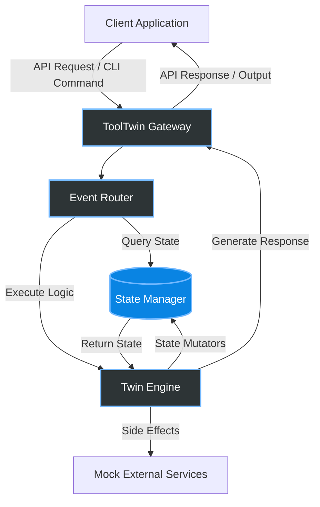

# 👯 ToolTwin

> **The Ultimate Digital Twin Framework for Developer Tools and APIs**

ToolTwin is a powerful, lightweight framework that allows you to create high-fidelity digital twins of your APIs, CLI tools, and microservices. Whether you're mocking complex stateful systems for testing, or simulating edge-case behaviors without affecting production, ToolTwin gives you the control you need.

---

## 🌟 Features

- **Stateful Mocking:** Simulate real database and memory states effortlessly.
- **Protocol Agnostic:** Supports REST, GraphQL, gRPC, and standard streams (stdin/stdout).
- **Time-Travel Debugging:** Rewind and replay tool interactions.
- **Zero Configuration:** Get started instantly with intelligent defaults.

---

## 🏗 Architecture

ToolTwin uses an event-driven architecture to intercept requests and simulate state transitions through a highly concurrent twin engine.



---

## 🚀 Installation

You can install ToolTwin via standard package managers.

### Using npm (Node.js)
```bash
npm install -g tooltwin
```

### Using Homebrew (macOS/Linux)
```bash
brew install tooltwin/tap/tooltwin
```

### Using Docker
```bash
docker pull tooltwin/core:latest
docker run -p 8080:8080 tooltwin/core
```

> [!TIP]
> For CI/CD environments, we recommend using the Docker image to ensure complete environment isolation.

---

## 📚 API Documentation

ToolTwin exposes a control-plane API to manage your digital twins on the fly.

### `POST /api/v1/twins`
Create a new digital twin instance.

**Request Body:**
```json
{
  "name": "payment-gateway-twin",
  "protocol": "REST",
  "initial_state": {
    "balance": 1000,
    "status": "online"
  }
}
```

**Response (`201 Created`):**
```json
{
  "id": "tw_9381283",
  "url": "http://localhost:8080/twins/tw_9381283",
  "status": "running"
}
```

### `GET /api/v1/twins/:id/state`
Retrieve the current state of a digital twin.

**Response (`200 OK`):**
```json
{
  "id": "tw_9381283",
  "state": {
    "balance": 1000,
    "status": "online",
    "transactions": []
  }
}
```

### `PUT /api/v1/twins/:id/scenario`
Load a specific testing scenario or fault injection into the twin.

**Request Body:**
```json
{
  "scenario": "latency-spike",
  "parameters": {
    "delay_ms": 2000,
    "error_rate": 0.1
  }
}
```

> [!WARNING]
> Fault injections are applied immediately. Ensure your test suites are prepared to handle simulated latency and errors.

---

## 🤝 Contributing

We welcome contributions! Please see our [CONTRIBUTING.md](CONTRIBUTING.md) for details on our code of conduct and the process for submitting pull requests.

## 📄 License

ToolTwin is MIT licensed. See the [LICENSE](LICENSE) file for details.
